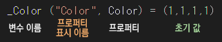

# Unity Shader
## 쉐이더 기초
해당 사이트 정리 
### 백분률
24bit 컬러의 흰색 -> R 255 G 255 B 255 
반대인 검정 -> R 0 G 0 B 0

다만 각 채널이 5,6,5bit가 되는 16bit라면?
흰색 -> R32 B64 B32

이는 압축포멧에 따라서 달라지며 이를 위해 나온것이 백분률
이를 이용하면 최대값이 달라져도 비율을 통해서 원하는 색을 도출하는 개념

### float
float는 32bit(약 42억)
소수점 아래 6번째까지 가능
코드상 색은 각 채널당 32bit를 이용하여 (R = 32bit) (G = 32bit) (B = 32bit)
백분률로 보면 1 = 100%
즉 float3 (1,1,1)로 볼 수 있다
알파를 표현하고 싶으면 float4(R,G,B,A) 즉 32bit를 한개 더 추가한다.

### 셰이더란?
셰이더는 3D 컴퓨터 그래픽에서 물체의 3차원 위치를 나타내는 x,y,z 좌표, 색, 텍스처, 조명등 다양한 시각적 효과를 계산하여 최종적으로 출력할 픽셀의 위치와 색상을 계싹하는 함

이를 위한 종류
HLSL (High Level Shading Language) - 가장 보편적
GLSL (OpenGL Shading Language) - OpenGL에서 사용
CG (c for Graphics) - 엔비디아, 마소 협력 언어

유니티가 사용하는 방식은 CG (URP 및 언리얼은 HLSL)
다만 각 언어들은 정말 유사하니 걱정은 하지 말자

### 유니티 셰이더
유니티의 경우 정통 CG가 아닌 스크립트로 이뤄져있다.
이를 통한 3가지 방법 존재 
1. Shader Lab - 호환성 짱 다만 가능 범위가 낮음 
2. Surface Shader - 
3. Vertex&Fragment Shader - Surface Shader의 상위 버전 CG를 디테일 하게 다룬다

이떄 Surface Shader는 Shader lab이라는 스크립트 안에 CG 코드가 있는 형식

#### Surface Shader
가장 쉽고 플랫폼에 잘 대응된다
Matrix 연산이 필요 없으며 Visual Shader Editor과 개념적으로 비슷하며
자동이라는 장점을 가지고 있는 대신 연산을 하지 않으니 고급적인 기능은 기대하기 힘들다.

코드의 영역을 확인해보면

이런식으로 구성되어있다.

가장위의 Shader 부분은 셰이더의 이름만이 아닌 경로를 의미한다.

**Property**

해당 영역은 변수를 선언하는 곳
여기서 선언된 변수들은 유니티 내부에서 수정이 가능하다

선언의 형태는 

이와 같으며 다른 형태로는
_Name("Name", Range(0,1)) = 0.5
_Name("Name", Int) = 0
_Name("Name", Color) = (1,1,1,1)
등이 있다

이때 주의해야 할 점으로 int의 경우는 통상적으로 정수만 표현 가능해야 하지만 소수점도 가능하다.
왜냐면 해당 영역은 인터페이스로 보여주기 위한 영역일 뿐이기 때문

**SubShader**

해당 영역은 셰이더의 기능을 정의하는 영역

Tags { "RenderType"="Opaque" }
해당 영역은 렌더링 타입을 정의하는 영역으로 Opaque는 불투명한 물체를 의미한다
Tags - 렌더링 타입을 정의하는 영역 (키-값 형태)
RenderType - 렌더링 방식 정의하는 영역
Opaque - 불투명한 물체를 의미

LOD 200
해당 영역은 레벨 오브 디테일을 의미한다 (Level of Detail)
높을수록 더 많은 연산을 하게 된다.
0 ~ 2000 사이

CGPROGAM - 지금부터 CG를 이용하겠다는 선언
이 영역은 ENDCG까지 전부 CG 언어로 이루어진다.

내부적으로 보면 SubShader는 3개의 영역으로 나줘진다.

**snippet**
\#pragma 부분으로
조명 계산 설정 및 세부적인 분기를 정해주며 전처리(Preprocessing)부분

\#pragma Surface
셰이더가 표면(Surface)임을 지정 - 오브젝트 표면의 조명 및 렌더링 방식

surf Standard
표변 셰이더 모델을 Standard로 설정
Standard는 물리기반 렌더링(PBR) 모델
실제 물리 법칙을 기반으로 렌더링되는 방식

fullforwardshadows
모든 광원에 대하여 포워드 렌더링(광원의 관점에서 정면) 경로에 그림자 효과를 적용

\#pragma target 3.0 - 셰이더 3.0 버전

**엔진 데이터 영역**
sampler2D _MainTex;
의 sampler 2D는 2D 텍스처를 샘플링

Struct Input는 구조체 형태로 엔진에서 받을 데이터를 정의한다.

half - 0~1 사이의 실수를 반환
Fixed4 - 유니티 셰이더에서 사용하는 4차원 벡터 (X,Y,Z,W)
16비트 정수값으로 색상, 좌표에 사용
다만 소수점값은 표변 불가하며 다른 벡터보다 메모리를 많이 사용

셰이더는 인스턴싱을 지원하며 이를 사용하는 머티리얼에서 'Enable Instancing'을 선택
인스턴싱은 여러 개의 오브젝트를 단일 드로우 콜로 렌더링하여 성능을 향상시키는 기술

위에서 더 많은 인스턴싱을 확인할 수 있다

UNITY_INSTANCING_BUFFER_START(Props) - 인스턴스 버퍼 시작
UNITY_INSTANCING_BUFFER_END(Props) - 인스턴스 버퍼 끝
이때 인스턴스 버퍼는 인스턴스당 데이터를 저장
이에 접근하기 위해서는 UNITY_ACCESS_INSTANCED_PROP 매크로를 사용

**함수 영역**   
색상이나 이밎가 출력되도록 만드는 영역
지금까지 만든 Property가 작동하도록 하는 장소
이때 inout이라는 키워드는 해당 변수가 입력과 출력을 동시에 한다는 의미

여기에 선언된 SurfaceOutputStandard는 셰이더의 출력을 정의하는 구조체
형태는
struct 
SurfaceOutputStandard
{
    fixed3 Albedo; - 표면의 반사율 (그림자 포함)
    fixed3 Normal; - 표면의 법선 벡터
    fixed3 Emission; - 자가 발광 색
    half Metallic; - 금속성
    half Smoothness; - 매끄러움
    half Occlusion; - occlusion 폐색
    half Alpha; - 투명도
};

이를 해당함수에서 활용하면 된다
Emission의 경우 발광하는 것을 보고 싶으면 포스트 프로세싱 Bloom을 적용

float끼리 계산할때는 같은 수의 float끼리 계산해야 한다
이는 float2는 float 2와 연산이 가능하고
float 3은 float 3과 연산이 가능하다는 뜻

만일 1 - float3(1,0,0)을 진행한다면?
float3(1,1,1) - float3(1,0,0)으로
결과적으로 float3(0,1,1)
이는 반전(invert)으로 포토샵도 반전을 하면 보색이 안나오고 다른 색이 나오는 이유는 이 때문

``` 예시
 void surf (Input IN, inout SurfaceOutputStandard o)
        {
            o.Albedo = fixed4(1,0,0,1);
            o.Metallic = _Metallic;
            o.Emission = float3(1,0,0) + 1;
        }
```

그렇다면 왜 property에서 선언된 부분을 SubShader에서 재선언 할까?
이는 현재는 Subshader가 한개이지만 추가적으로 선언할 수 있고 이에 따라 property의 변수를 다르게 가져갈 수 있기 때문
즉
property에 _Color ("Color", Color) = (1,1,1,1)
라고 선언되어 있지만
SubShader1에서는 _Color ("Color", Color) = (1,0,0,1)
SubShader2에서는 _Color ("Color", Color) = (0,1,0,1)
이렇게 가져갈 수 있음

이는 Subface Shader를 한개가 아닌
여러개를 한개의 스크립트에 정의할 수 있다는 뜻이 된다
``` 예시
 Shader "MyCustomShader" {  
      SubShader{  
          // A급 디바이스용 (최상의 품질로 구현) 
     }  
      SubShader{  
          // B급 디바이스용  
     }  
      SubShader{  
          // C급 디바이스용  
     }  
      SubShader{  
          // 그 밖의 초저사양 디바이스들 (매우 후진 품질로 구현)  
     }  

     Fallback "Diffuse"  
}
```

**Fallback**
만일 현재 셰이더가 특정 플랫폼에나 그래픽 하드웨어에서 작동하지 않는다면 대체로 사용될 셰이더를 지정

작동순서는 셰이더가 렌더링 될때 동작 가능 SubShader를 찾음
없다면 Fallback에 지정된 Shader으로 이동
이에서 가능한 SubShader를 찾는다
여기에도 없다면 오류 발생

**Pass**
Pass는 렌더링의 단계를 정의하는 영역
렌더링 파이프라인의 단계에서 실행되는 코드
특정 렌더링 조건에 맞는 오브젝트를 렌더링 하는 방법을 정의하고 렌더링 순서, 방식, 셰이더 코드를 설정하는 역할이다
pass의 수만큼 오브젝트가 렌더링된다
SubShader{ 
          Pass{ //  ...  // } 
          Pass{ //  ...  // } 
     } 

     SubShader{ 
          Pass{ //  ...  // } 
     } 
     이러한 형태가 된다.

구성
Name "Name" - 해당 pass의 이름
Tags - Pass에 적용될 태그
Shader - Pass 사용될 코드

종류
Forward - 불투명 오브젝트 렌더링
Deferred - 투명 오브젝트 렌더링
ShadowCaster - 그림자 투사
ShadowReceiver - 그림자 수신
Custom - 사용자 정의 렌더링


``` 사용 예시
Shader "MyShader" {
  Properties {
    _Color ("Color", Color) = (1,1,1,1)
  }
  SubShader {
    Tags { "RenderType"="Opaque" }
    Pass {
      Name "Forward"
      Tags { "RenderType"="Opaque" }
      Shader "MyShader" {
        Properties {
          _Color ("Color", Color) = (1,1,1,1)
        }
        SubShader {
          Tags { "RenderType"="Opaque" }
          LOD 200
          CGPROGRAM
          #pragma surface surf Standard fullforwardshadows
          #pragma target 3.0
          SAMPLER2D _MainTex;
          struct Input {
            float2 uv_MainTex;
          };
          half _Glossiness;
          half _Metallic;
          fixed4 _Color;
          void surf (Input IN, inout SurfaceOutputStandard o) {
            // 셰이더 코드
          }
          ENDCG
        }
      }
    }
  }
}
```